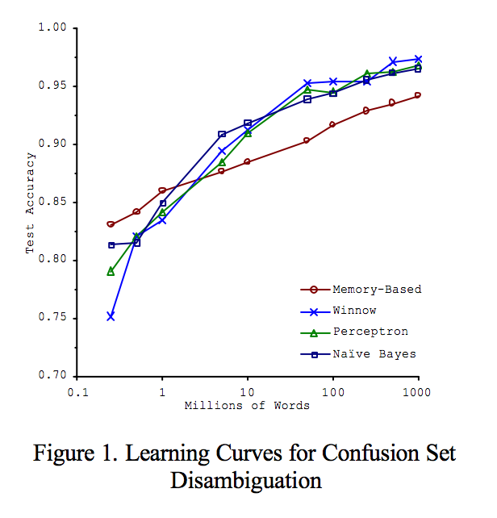

## Overview

- Data Problems
- OSEMN Process
- Tips and Tricks

## Data Problems

How do we use data to solve problems?

It's not always clear how to go from data to clear understanding. (Real world problems cannot by tackled by just reading in a CSV and blindly fitting a model.)

Example: Genome Sequencing <br>
Biologists were able to acquire full instruction manual on how an organism will develop, but multidisciplinary collaborations and advances in mathematical and statistical methods were needed to rigorously understand and fully utilize such sequences.

## Data Problems (continued)

Modern data problems don't come with a cookbook type solution because domain expertise is not always present for the datasets we are analyzing. 

> `-` research in which data vastly outstrip our ability to posit models is qualitatively different
> <br>
> `-` complex systems for which the underlying models are not yet known but for which data are abundant
> <br>
> [Applying Big Data Approaches to Biological Problems, Chris Wiggins (2012)](http://engineering.columbia.edu/web/newsletter/fall_2012/applying_big_data_approaches_biological_problems)

<br> Hence, we need a **process** of doing data science.

## Process of Doing Data Science

Commonly Recommended Process: [OSEMN](http://www.dataists.com/2010/09/a-taxonomy-of-data-science/)

- Sounds like "awesome"
- Stands for:
    + Obtain
    + Scrub
    + Explore
    + Model
    + iNterpret

## Obtain 

- Tends to be overlooked, but is in fact critical
- Process needs to be scalable
    + Using APIs 
        * Python: [`requests`](http://docs.python-requests.org/en/latest/)
        * R: [`jsonlite`](https://cran.r-project.org/web/packages/jsonlite/vignettes/json-apis.html)
    + SQL Queries 
        * Python: [`pandas`](http://pandas.pydata.org/pandas-docs/stable/io.html#sql-queries) (with [SQLAlchemy](http://www.sqlalchemy.org/))
        * Python: [`pandas`](http://www.datacarpentry.org/python-ecology/08-working-with-sql) (with [SQLite](https://www.sqlite.org/))
        * R: [`dplyr`](https://cran.r-project.org/web/packages/dplyr/vignettes/databases.html)
    
## Obtain 
- Tends to be overlooked, but is in fact critical
- Process needs to be scalable
    + Command Line Tools
        * UNIX Tools: `cat`, `grep`, `uniq`, `sort`, `sed`, `awk`
        * [Data Science at the Command Line: Facing the Future with Time-Tested Tools (Janssens; 2014)](http://shop.oreilly.com/product/0636920032823.do)
    + Web Scraping
        * Python: [`BeautifulSoup`](http://web.stanford.edu/~zlotnick/TextAsData/Web_Scraping_with_Beautiful_Soup.html)
        * R: [`rvest`](http://blog.rstudio.org/2014/11/24/rvest-easy-web-scraping-with-r/)
        
## Obtain

<div class="notes">
You have some sort of folder organization, probably data, explore_plots, reports, etc. (Will get into it later)
</div>

Pseduo-code:
```
raw_data_folder = "<your folder here>"
list_of_files = get_list_of_files()
for file in list_of_files:
    if (not using cache) or (file does not exist):
        process(file, raw_data_folder)
```

## Scrub 

The real world is very messy, so we need to do some clean up before processing it.<br>
Solution: [Tidy Data](http://vita.had.co.nz/papers/tidy-data.pdf)

[Elements of Tidy Data](http://jtleek.com/modules/03_GettingData/01_03_componentsOfTidyData/#2) according to Jeff Leek of JHU Data Science MOOC Fame:

<div style="margin-top: -20px">
1. Raw data
2. Tidy data set
3. A code book describing each varaible and its values in the tidy data set
4. An explicit and exact recipe you used to go from 1 to 2 and 1 to 3
</div>

## Scrub

> A simple analysis of clean data can be more productive than a complex analysis of noisy and irregular data.
> <br>
> [Hilary Mason and Chris Wiggins, A Taxonomy of Data Science (2010)](http://www.dataists.com/2010/09/a-taxonomy-of-data-science/)

<br>
You should be able to explain your data in simple sentences as opposed to highly contrived transformations that aren't intuitive or are hard to follow.

## Scrub

Pseduo-code:
```
def clean_up(f):
    f = transformation_1(f)
    f = transformation_2(f)
    f = transformation_3(f)
    .
    .
    .

for file in raw_data_folder:
    clean_data = clean_up(file)
    store(clean_data, clean_data_folder)
```

## Explore

<div class="notes">
Define feature engineering
</div>

- Best ideas for feature engineering start here
    + Feature engineering: designing new variables that capture patterns in data
    + Most models perform roughly equivalently once you get enough data
- "Dirty" plots will help with this 
    + Don't have to be pretty, have axis labels, etc.
    + Do have to be fast, so that we can iterate
- Notebook/R Markdown will allow you to note ideas that come in handy during modeling

## Explore

Pseduo-code:
```
for column in variables:
    save(histogram of column)
for col1, col2 in pairs(variables):
    save(scatterplot of (col1, col2))
```

## Model 

- Make sure to use cross validation for hyperparameter tuning
- Make the right tradeoff between interpretability and performance
    + If you just care about prediction, go nuts with a deep learning network
    + If the goal is analysis and understanding, try something simpler like a Support Vector Machine
    
## Model    

Pseudo-code:
```
from sklearn.cross_validation import train_test_split
from sklearn.svm import SVC

X_train, X_test, y_train, y_test = train_test_split(X, y, test_size = 0.2)
svm = SVC()
svm.fit(X_train, y_train)
svm.score(X_test, y_test)
```

## iNterpret

> The purpose of computing is insight, not numbers.
> <br>
> [Richard Hamming, Numerical Methods for Scientists and Engineers (1962)](http://www-history.mcs.st-and.ac.uk/Extras/HammingReviews.html)

<br>
Besides you and other data nerds, no one really cares about the test error your model obtained; what people really care about is the *outcome* of using your model.

The best way to let people understand your model is to let them play with it.

## iNterpret


<br>
It lets you generate interactive web applications using purely R code. (You can edit the resultant HTML, CSS, and JavaScript code.)

## iNterpret


<br>
It lets you generate interactive web applications using Python and JavaScript code.

## iNterpret

Pseudo-code:
```
make_interactive_data_product()
```

## Tips and Tricks

- 80/20 Split on Cleaning vs Modeling
- More Data Wins
- Reproducibility
- Iteration

## The 80/20 Split
<div class="notes">
Not just for training and testing proportions!
</div>
- Time spent preparing data compared to time modeling data is 80/20
- Have to get the 80% right to get interesting 20% results

## More Data Wins

Scaling to Very Very Large Corpora for
Natural Language Disambiguation (Banko, Brill; 2001)


## Reproducibility

- We need to be able to retrace our steps
    + Helpful for debugging
- Others need to recreate our results
    + Gives credibility to our findings
    
## Iteration


- creator of `ggplot2`, `dplyr`, `devtools`
- Chief Scientist at RStudio 
- ... yeah, that Hadley Wickham

## Thanks

Any questions?